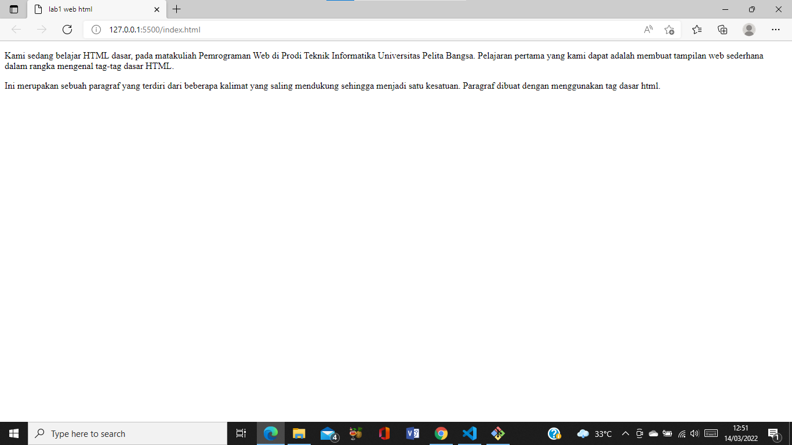
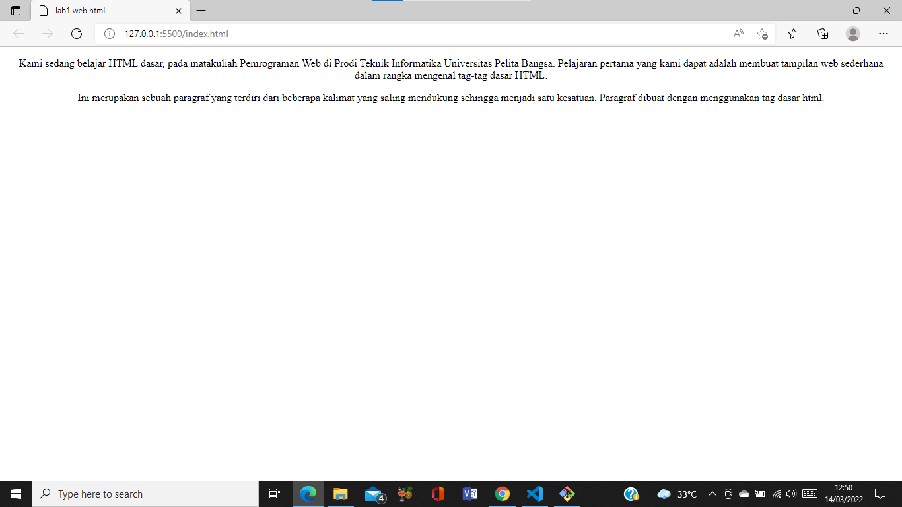
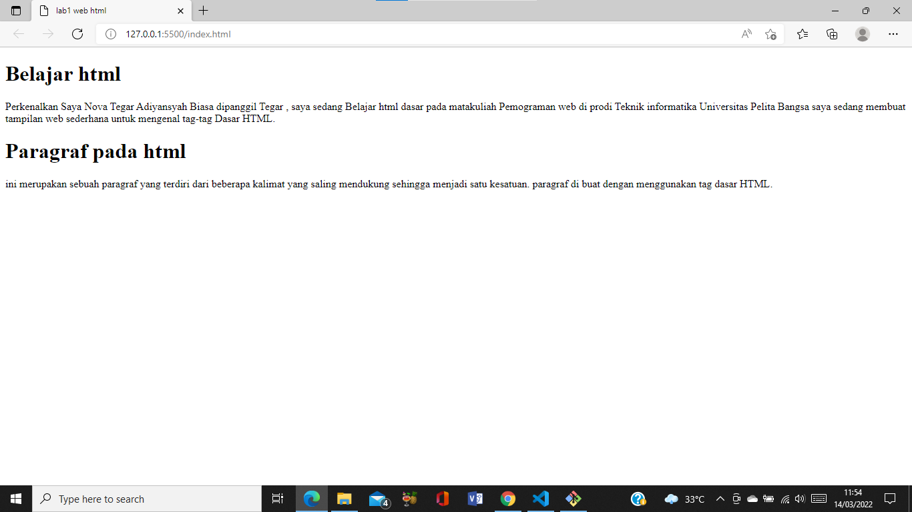
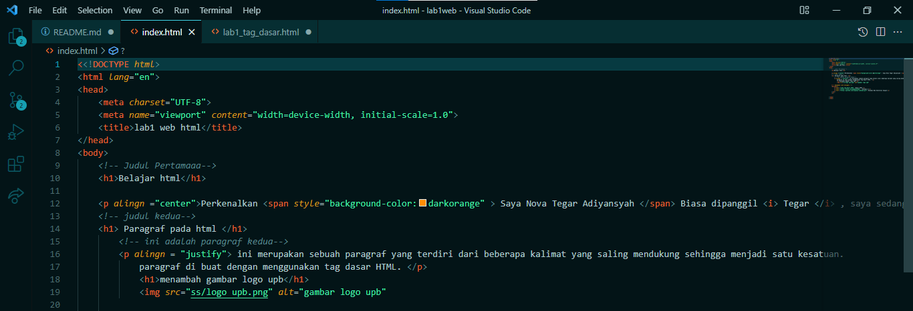
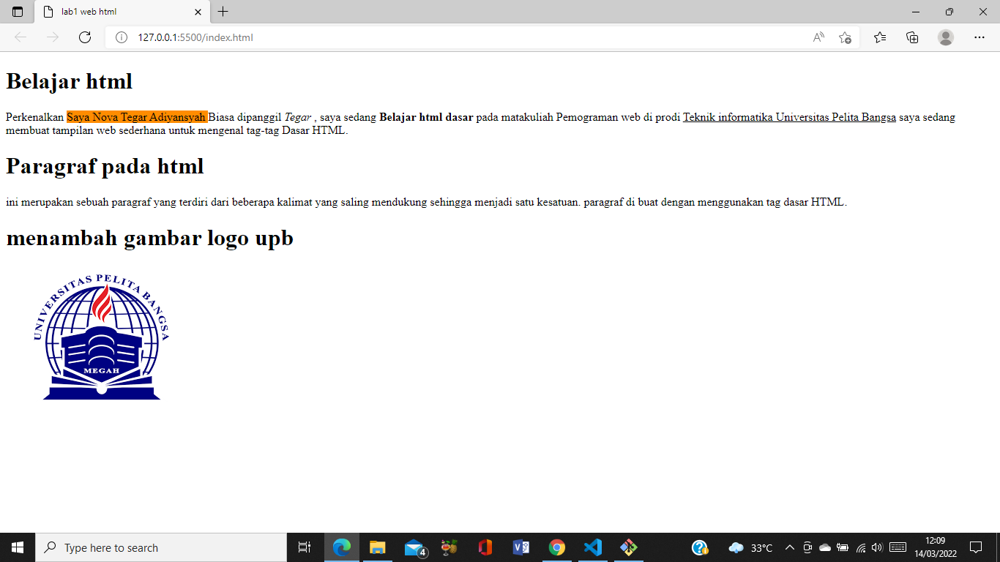

#  **Tugas2 Program Web** 
## <tb>lab 1 web html
## Nama : Nova Tegar Adiyansyah
## Nim  : 312010145 <tb>

# Langkah-langkah Pratikum

## Disini saya akan menjelaskan cara membuat web dengan HTML. Pertama siapkan apk VSCODE pada gambar dibawah :
 

## Buat file baru dengan nama <b>lab1_tag_dasar.HTML</b>
 
 
## kemudian <b>klik kanan</b> pilih open with live server.saya Menggunakan <b> Google Chrome </b>

# 1. Membuat Paragraf
  
disini saya akan membuat paragraf sederhana atur atribut untuk melihat perubahannya.Selanjutnya ubah-ubah nilai atributnya (align => justify, left, right, dan center) untuk melihat
perbedaan lainnya. 

## Gambar Paragraf sebelum di ubah

## Hasil gambar setelah diubah

# 2. Menambahkan Judul 

Seperti sudah dijelaskan pada materi bahwa judul memiliki 6 level yaitu mulai h1 sampai h6.
Kemudian tambahkan judul h1 sebelum paragraf pertama dan tambahkan sub judul h2 sebelum
paragraf kedua.
 saat di klik kanan hasinya akan seprti gambar dibawah : 

# 3. Memformat Teks

### Masukan code teks seperti gambar dibawah untuk melihat perubahan. 

### lalu klik kanan dan hasilnya akan muncul seperti ini 

# 4. Menyisipkan Gambar

### Untuk menyisipkan gmbar, siapkan gambar yang akan disisipkan pada halaman web, kemudian
### simpan file gambar tersebut satu folder dengan file dokumen html.

### Kemudian tambahkan tag img setelah paragraf yang kedua, dengan menambahkan heading 3
sebelumnya.

### Simpan perubahannya, kemudian refresh browser,maka akan muncul seperti gambar berikut 

# 5. Menambahkan Hyperlinks

