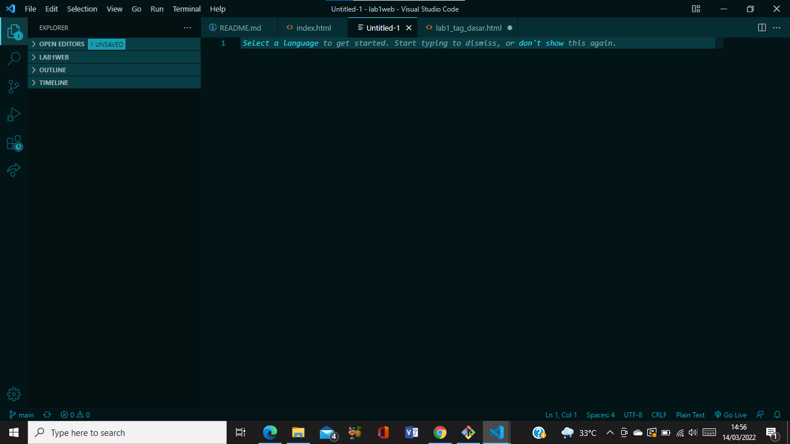
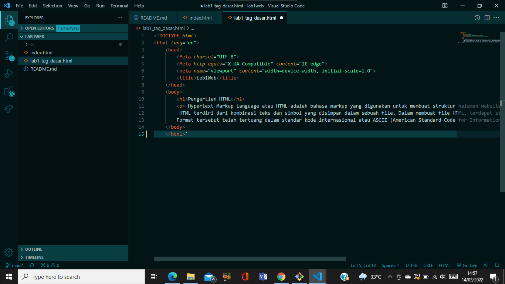
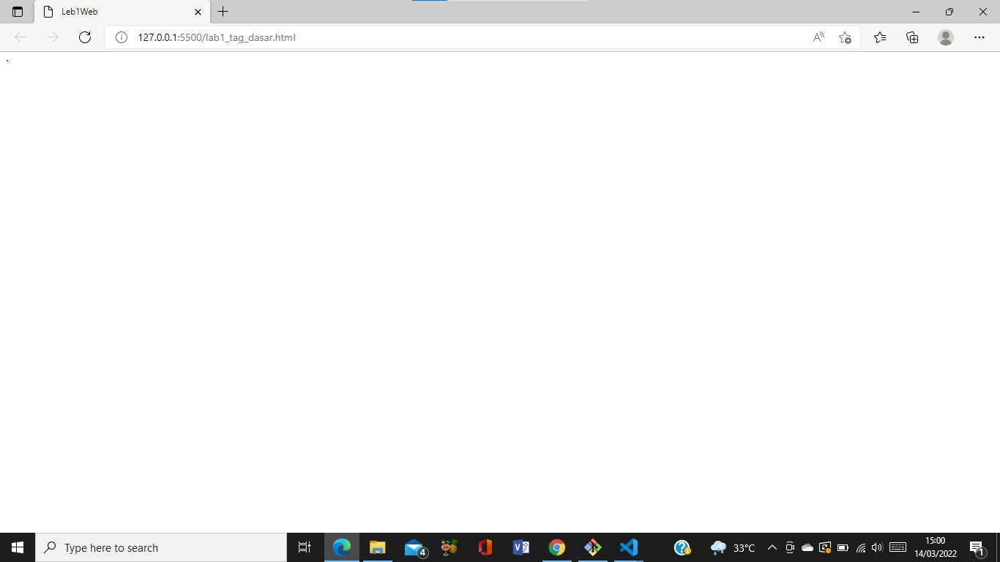

#  **Tugas2 Program Web** 
## <tb>lab 1 web html
## Nama : Nova Tegar Adiyansyah
## Nim  : 312010145 <tb>

# Langkah-langkah Pratikum

 Disini saya akan menjelaskan cara membuat web dengan HTML. Pertama siapkan apk VSCODE pada gambar dibawah :
 

  Buat file baru dengan nama <b>lab1_tag_dasar.HTML</b>
 
 
kemudian <b>klik kanan</b> pilih open with live server.saya Menggunakan <b> Google Chrome </b>

# 1. Membuat Paragraf
  

    