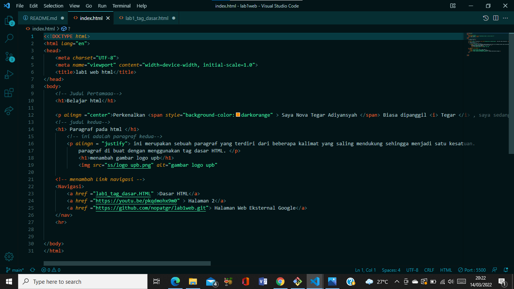
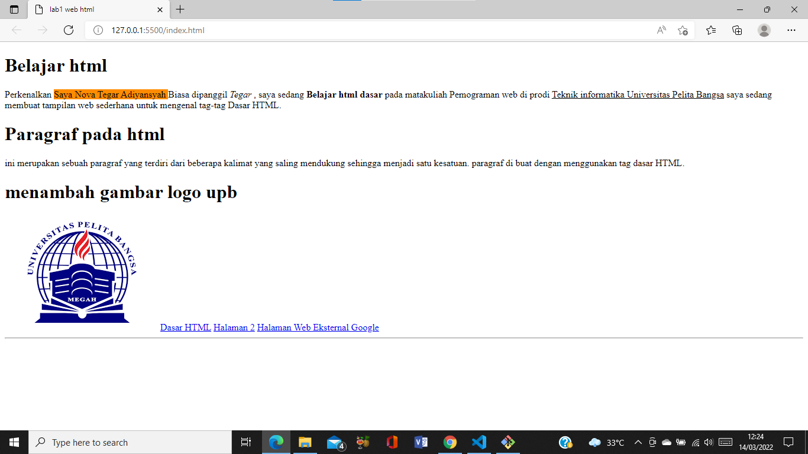

#  **Tugas 2 Program Web** 

## Belajar HTML Dasar   
## Nama     : Nova Tegar Adiyansyah 
## Nim      : 312010145 
## Kelas    : TI.20.A1 

# Langkah-langkah Praktikum 

Disini saya akan menjelaskan cara membuat web dengan HTML. Pertama siapkan apk VSCODE pada gambar dibawah :
 

Buat file baru dengan nama <b>lab1_tag_dasar.HTML</b>
 
 
kemudian <b>klik kanan</b> pilih open with live server.saya Menggunakan <b> Google Chrome </b>
 

# 1. Membuat Paragraf
  
disini saya akan membuat paragraf sederhana atur atribut untuk melihat perubahannya.Selanjutnya ubah-ubah nilai atributnya (align => justify, left, right, dan center) untuk melihat
perbedaan lainnya. 

 Gambar Paragraf sebelum di ubah

 Hasil gambar setelah diubah

 

# 2. Menambahkan Judul 

Seperti sudah dijelaskan pada materi bahwa judul memiliki 6 level yaitu mulai h1 sampai h6.
Kemudian tambahkan judul h1 sebelum paragraf pertama dan tambahkan sub judul h2 sebelum
paragraf kedua.
 saat di klik kanan hasinya akan seprti gambar dibawah : 

 

# 3. Memformat Teks

Masukan code teks seperti gambar dibawah untuk melihat perubahan. 

 lalu klik kanan dan hasilnya akan muncul seperti ini 

 

# 4. Menyisipkan Gambar

Untuk menyisipkan gmbar, siapkan gambar yang akan disisipkan pada halaman web, kemudian
simpan file gambar tersebut satu folder dengan file dokumen html.

Kemudian tambahkan tag img setelah paragraf yang kedua, dengan menambahkan heading 3
sebelumnya.

Simpan perubahannya, kemudian refresh browser,maka akan muncul seperti gambar berikut 

 

# 5. Menambahkan Hyperlinks

Tambahkan hyperlink pada dokumen sebelum heading 1 seperti berikut :

Maka hasilnya akan seperti berikut

  

 

 

## ========== TERIMA KASIH ==========  
## ================================  

## Jawab Pertanyaan Berikut 

1. Lakukan perubahan pada kode sesuai dengan keinginan anda, amati perubahannya adakah 
error ketika terjadi kesalahan penulisan tag?
2. Apa perbedaan dari tag < p > dengan tag < br >, berikan penjelasannya!
3. Apa perbedaan atribut title dan alt pada tag < img >, berikan penjelasannya!
4. Untuk mengatur ukuran gambar, digunakan atribut width dan height. Agar tampilan gambar 
proporsional sebaiknya kedua atribut tersebut diisi semua atau tidak? Berikan penjelasannya!
5. Pada link tambahkan atribut target dengan nilai atribut bervariasi ( _blank, _self, _top, 
_parent ), apa yang terjadi pada masing-masing nilai antribut tersebut?

## Jawaban 

1. Disini saya melakukan perubahan dengan menghilangkan tag < /h > Menjadi < h1 > maka seluruh elemen akan mengikuti tag < h1 > karena tidak ada penutup

2. Tag < p > untuk memberikan perintah paragraf pada html tag. Sedangkan < br > berfungsi untuk memberikan perintah breakline atau baris baru.

3. <b> title </b> berfungsi untuk memberikan judul pada gambar. <b> alt </b> berfungsi untuk menunjukan sebuah alternatif teks apabila gambar tidak dapat ditampilkan.

4. Karena jika menggunakan keduanya ukurannya web tidak simetris. sedangkan jika hanya menggunakan salah satu ukurannya akan bertambah besar secara simetris.

5. <_blank > membuka link di tab baru. 
    < _self > membuka link di frame link itu berada. 
    < _top > Untuk membuka link di frame paling atas.contohnya jika website A didalam ada website B lalu website B di dalamnya ada website C lalu website C ini ada link dan kita klik, maka link akan terbuka di website C. 
    < _parent > untuk membuka link di frame yang satu tingkat di atas frame link tersebut berada. 

